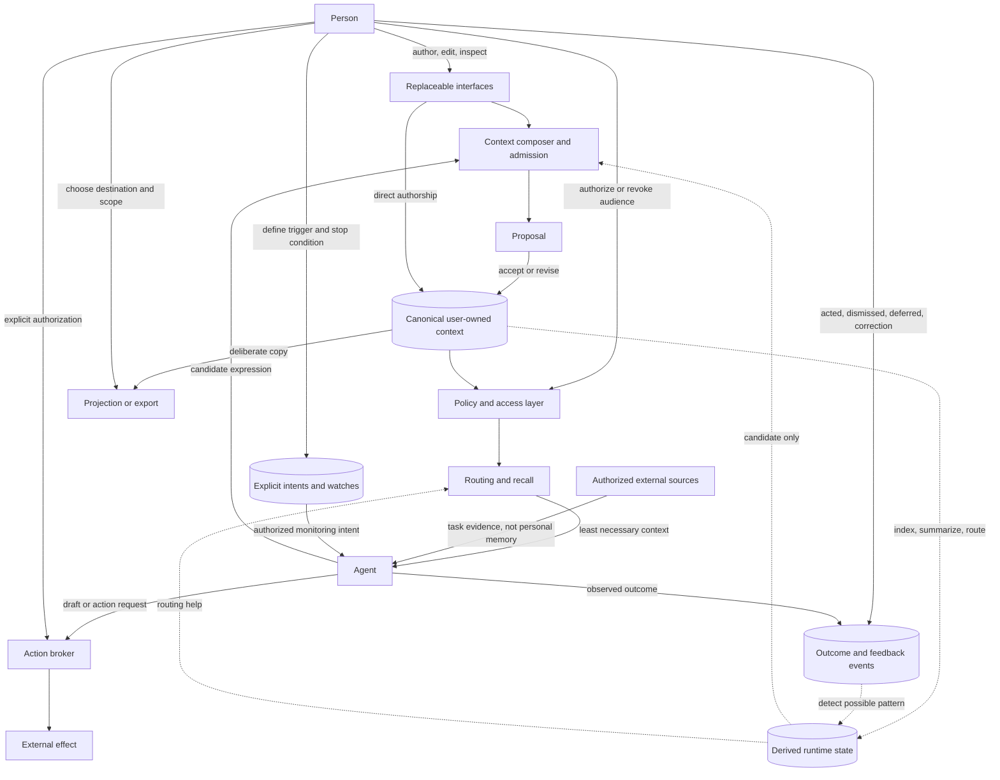

# System map

**Status:** Conceptual architecture and protocol boundary. Non-normative.

`me.md` does not need to standardize an entire agent product.

A useful application may include agents, source connectors, ranking, watches, feedback, actions, and presentation. The protocol's job is to make the person's authority and the movement of their context clear across those pieces.

This map separates user-owned state, runtime-derived state, agent behavior, and external effects so that none of them quietly collapse into “memory.”

## Conceptual map

The arrows describe possible responsibilities, not required services or APIs.

## The person and the interface

The person is the authority. Interfaces help them exercise that authority.

An interface may be a settings panel, editor, command line, chat interaction, or something else. It should make it possible to:

- inspect and author context;
- understand scope and audience;
- accept, revise, defer, or dismiss proposals;
- change access and capability settings;
- correct, disable, forget, delete, export, or project context.

No interface should become the only place where the person's context can be understood or controlled.

## Canonical context and admission

Canonical context is the person-governed source of truth.

The admission layer handles the boundary between something said or observed in the moment and something retained for future use.

There are several distinct paths:

- **Direct authorship:** the person writes or edits context themselves.
- **Explicit recording:** the person directly asks for an exact statement to be kept.
- **Agent proposal:** an agent offers a candidate expression that remains inactive until the person accepts or revises it.
- **Import:** the person knowingly brings context from another source.

Derived patterns, scores, summaries, or observations do not become canonical context by themselves.

## Policy and access

The policy and access layer answers questions that context alone cannot answer:

- Is this store or scope enabled?
- Which agents or interfaces may use it?
- For what purpose?
- May the agent only read, or may it propose changes?
- Which operations require explicit authorization?

These controls should be enforced outside the model prompt.

Turning context off should make recall and proposal operations fail at the access layer, including for already-running sessions where practical. Context is not meaningfully disabled if an agent still retains a working path to it.

## Routing and recall

Routing decides which context might be relevant. Recall selects the context supplied to the current task.

Both should follow the least-context principle:

- use a sparse global layer;
- retrieve topic context only when relevant;
- attach project context only to that project;
- avoid revealing a complete sensitive topic map when narrower routing is possible;
- treat the person's present instruction as higher priority than durable defaults.

Routing mechanisms—filenames, metadata, local models, embeddings, rules, or indexes—are implementation choices. They remain derived state and must not become a hidden competing profile.

## Agents and external sources

An agent consumes context while helping with a task. It does not own the context.

Authorized external sources may supply evidence for the task: calendar events, documents, code, messages, or other changing information. That source material is not automatically personal memory.

An application should distinguish:

- what came from the person-owned context source;
- what came from an external source;
- what the agent inferred;
- what could not be read or verified.

Coverage and uncertainty should remain visible when they materially affect an answer.

## Action remains separate

Context can constrain an action, but it cannot authorize one.

For example, a durable boundary may say:

> Always ask before sending something as me.

That boundary narrows the agent's authority. No context entry should grant permission to send, publish, purchase, approve, disclose, or delete on the person's behalf.

Consequential actions should pass through a separate action broker that can bind authorization to the exact operation, destination, and payload.

## Outcomes and feedback events

What happened is different from what is true about the person.

A person may record that they:

- acted on a suggestion;
- dismissed it;
- deferred it;
- found something useful or noisy;
- corrected an interpretation;
- changed a decision.

These are outcome or feedback events. They may help an application avoid repeated mistakes or evaluate whether a recommendation cleared. They are not automatically durable personal context.

Events can support later reflection, but reflection should produce a proposal rather than silently rewrite the person.

## Explicit intents and watches

A watch is a user-owned monitoring intent, not inferred memory.

A useful watch states:

- what to observe;
- where to observe it;
- what change or threshold matters;
- what should happen when it triggers;
- when the watch expires or stops.

Watches should be inspectable, editable, and removable. They should not silently widen source access or action authority.

## Derived runtime state

Applications may create state for performance or intelligence, including:

- indexes and embeddings;
- summaries and rankings;
- urgency scores;
- collaboration graphs;
- recurring-pattern candidates;
- cached source results;
- run artifacts and presentation state.

Derived state is subordinate to canonical context and explicit policy.

It should be:

- rebuildable where practical;
- excluded from portability by default unless deliberately requested;
- included in disablement and deletion semantics;
- prevented from silently restoring forgotten context;
- distinguishable from user-authored truth.

## Projection, export, and synchronization

A projection is a rendered copy supplied to another agent or instruction surface. An export is a portable copy the person can move. Synchronization keeps copies aligned.

None of these operations is automatic merely because context is portable.

The person should choose:

- which subset moves;
- which destination receives it;
- whether the copy remains linked to the source;
- how updates and deletions propagate;
- whether derived state or history is included.

A projection is never the canonical source of truth.

## State classes

| State class | Typical examples | Default ownership and portability |
| --- | --- | --- |
| Canonical context | Preferences, boundaries, topic facts, project context | User-owned; portable only within chosen scope |
| Policy and authorization | Enabled state, audiences, capability limits | User-governed; may remain local to an implementation |
| Proposals and decisions | Candidate expressions, acceptance, dismissal | Private; proposals inactive until admitted |
| Intents | Watches, declared priorities, stop conditions | User-owned optional extension |
| Outcome events | Acted, dismissed, deferred, correction, useful/noisy | Private optional extension; not automatically memory |
| External evidence | Calendar data, documents, code, messages | Source-governed; minimize persistence |
| Derived state | Indexes, scores, summaries, patterns, caches | Local-private and rebuildable by default |
| Projection or export | Copies for another tool or device | Non-canonical; deliberate and reversible |
| External effects | Sent messages, purchases, comments, deletions | Separately authorized; never granted by context |

## What is contract, experiment, or implementation?

### Human contract

The project currently treats these as foundational:

- the person is the authority;
- durable context is chosen and legible;
- context has scope and audience;
- current instruction beats stored defaults;
- action permission remains separate;
- disablement, forgetting, and deletion are meaningful;
- projections and interfaces remain replaceable.

### Protocol hypotheses

These deserve public experiments and may later become shared contracts:

- a context composer and admission preview;
- global, topic, project, and session scopes;
- provenance records;
- machine-readable capability and portability manifests;
- feedback-event and watch extensions;
- coverage and explanation receipts;
- reflection that proposes rather than silently learns.

### Implementation choices

These should not become protocol requirements without strong evidence:

- a particular filesystem layout or database;
- a specific model or prompt;
- interface design and agent personality;
- source connectors;
- ranking formulas and thresholds;
- exact urgency labels;
- scheduling and background services;
- named agent collections;
- product-specific workflows.

## Questions this map should force

When reviewing an implementation, ask:

- Where is the canonical source of truth?
- What additional state exists, and can it influence behavior?
- Who can read each scope?
- What happens when access is disabled mid-session?
- Can an observation become durable without admission?
- Can feedback or a pattern become a claim about the person automatically?
- Can context accidentally grant action authority?
- Which copies exist outside the canonical source?
- What does forgetting or deletion remove from every layer?
- Could another interface preserve the same human contract?

The system is sovereign only when the answers remain understandable to the person, not merely to the implementation team.
